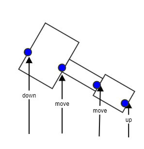
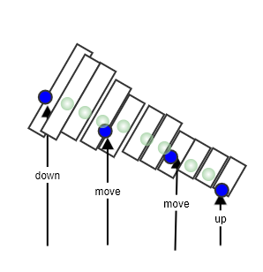

# draw

笔迹还原的绘制模块，支持输入单页的数据，然后生成还原图片。

## 使用方法

### 运行

```shell
git clone ssh://git@github.com/smarty-pen/drawer.git
go run main.go [options]
```

### options 参数说明

```
-background string
        背景图片的完整路径，默认为空
-disable-pressure int
        是否禁用压感，默认为启用，设置为1代表禁用
-input string
        数据文件的完整路径，数据文件的说明参见下面
-output string
        生成图片的完整路径 (default "result.png")
```

### 数据文件格式

数据文件是一个 JSON 文件，需要遵循如下结构

```json
[
    {
        "dot":{
            "force":140,//压感
            "fx":54,//x坐标小数部分
            "fy":39,//y坐标小数部分
            "type":"PEN_DOWN",//笔画类型
            "x":31,//x坐标整数部分
            "y":85//y坐标整数部分
        }
    }
]
```

## 已知问题

### 1. 使用压感后绘制图片发虚

由于智能笔上报的笔画数据中，部分点压感值比较小，会导致笔画有不连贯的假象。



需要在一个笔画的路径上，补充若干点进行修正，减少这种落差感。




